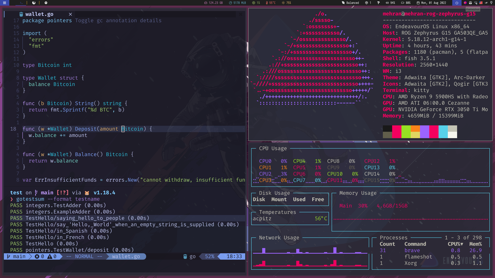

# ⚙️  Dotfiles

My personal dotfiles in the linux system using **chezmoi** (dotfile manager). 
- [Why use chezmoi?](https://www.chezmoi.io/why-use-chezmoi/)
- [Chezmoi Quick Start](https://www.chezmoi.io/quick-start/)


## ⚡ Usage

<details>
  <summary>1. Install Chezmoi </summary>

  #### curl
    ```bash
    sh -c "$(curl -fsLS chezmoi.io/get)"
    ```
  #### wget
    ```bash
    sh -c "$(wget -qO- chezmoi.io/get)"
    ```
  #### PowerShell
    ```bash
    (irm -useb https://chezmoi.io/get.ps1) | powershell -c -
    ```
  #### Arch
    ```bash
    pacman -S chezmoi
    ```
</details>

<details>
<summary>2. Get dotfiles</summary>

```bash
chezmoi init
```
- This will create a new git local reposityry in ~/.local/share/chezmoi where chezmoi will **store its source sate**
---
- Install your dotfiles on new machine with a single command
```bash
chezmoi init --apply https://github.com/username/dotfiles.git
```
</details>
<details>

<summary>3. Use chezmoi</summary>

#### Add
```bash
chezmoi add ~/.bashrc
```
- This will copy `~/.bashrc` to `~/.local/share/chezmoi/dot_bashrc`.

#### Edit
```bash
chezmoi edit ~/.bashrc
```
- This will open `~/.local/share/chezmoi/dot_bashrc` in your `$EDITOR`. Make some changes and save the file.
#### Diff
```bash
chezmoi diff
```
- see what changes chezmoi would make
#### Apply
```bash
chezmoi -v apply
```
- `-n` for dry run
#### Update
```bash
chezmoi update
```
- pull the changes from your repo and apply them in a singe command
</details>


## Tools I am using
- [Kitty](https://sw.kovidgoyal.net/kitty/): Graphics processing unit-accelerated terminal emulator for Linux and macOS
- [Fish](https://fishshell.com/): Unix shell with a focus on interactivity and usability
- [Neovim](https://neovim.io/): Enable new applications without compromising Vim's traditional roles
- [Picom](https://github.com/yshui/picom): A lightweight compositor for X11
- [Polybar](https://github.com/polybar/polybar): Customizable status bar
- [Ranger](https://github.com/ranger/ranger): File manager with text-based user interface for Unix-like systems
- [Starship](https://starship.rs/): Minimal, blazing fast, and extremely customizable prompt for any shell!
- [Tmux](https://github.com/tmux/tmux/wiki): Terminal multiplexer for Unix-like operating systems
- [i3](https://i3wm.org/): Tiling window manager designed for X11
- [Lazygit](https://github.com/jesseduffield/lazygit): Simple terminal UI for git commands
- [Nerd Fonts](https://nerdfonts.com): Patches developer targeted fonts with a high number of glyphs (icons)
- [Tokyo Night Theme](https://github.com/folke/tokyonight.nvim): A dark and light Neovim theme
